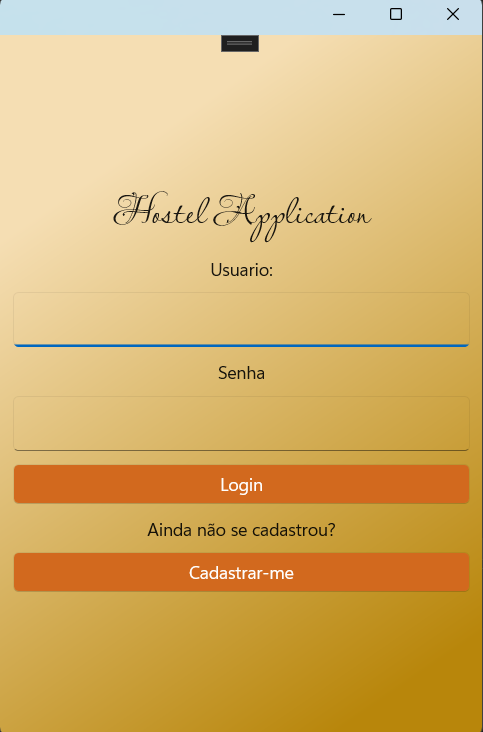
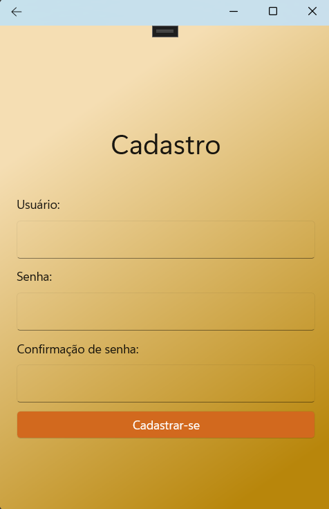
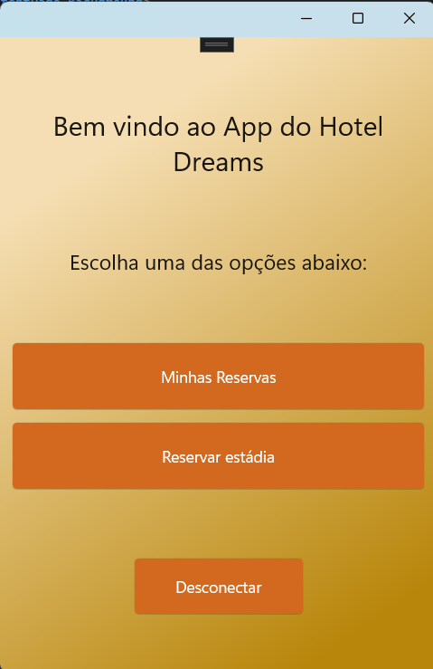
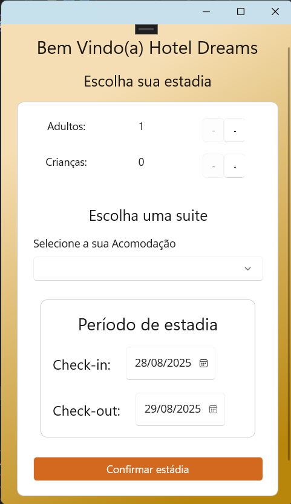
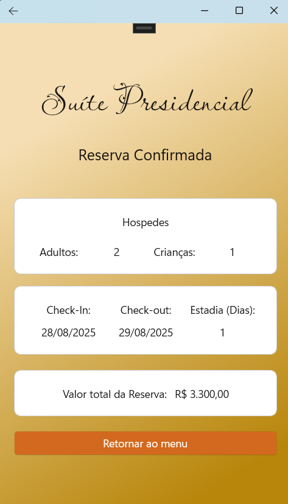

# Aplicação de Hotelária (Hotel Management Application) em .NET MAUI

## Descrição do Projeto

 Projeto desenvolvido em C# utilizando sua framework .MAUI (desenvolvimento de softwares desktop & mobile).

 O projeto tem como foco o desenvolvimento de habilidades em .NET MAUI, C# e conceitos de desenvolvimento de software, como orientação a objetos, design de interfaces, redirecionamento de páginas, domínio dos conceitos de Property's do C# como o INotifyProperty, dentre outros conceitos chaves.

 Sendo assim, utilizando o <a href="https://github.com/DaviPedrosaOficial/MauiAppLogin">sistema de login</a> criado anteriormente para auxiliar no controle de entrada, desenvolvi um programa para simular um aplicativo de locação de quartos em um hotel, onde o mesmo conta com 3 páginas centrais, são elas:

 <ul>
	<li>MainPage: Home de nosso projeto</li>
	<li>ContratacaoReserva: Página de contratação da estadia no hotel</li>
	<li>ReservasHospedagem: Página de visualização e edição das reservas feitas</li>
 </ul>

 Todo o projeto foi desenvolvido utilizando o padrão MVVM (Model-View-ViewModel), que é amplamente utilizado em aplicações .NET MAUI para separar a lógica de negócios da interface do usuário.

 Por fim, o projeto conta também com comentários explicativos em seu código-fonte para facilitar o entendimento das funcionalidades implementadas e tornar a compreensão do mesmo, mais acessível para outros desenvolvedores que possam vir a trabalhar no projeto futuramente.

 ### Requisitos

 <ul>
   <li>IDE de sua escolha: Visual Studio Community, JetRiders, ...</li>
   <li>SDK .NET: Utilizado no projeto é a 9.0. Nâo possui o .NET ainda? <a href="https://learn.microsoft.com/pt-br/dotnet/maui/get-started/installation?view=net-maui-9.0&tabs=visual-studio"     target="blank">Instalar SDK</a></li>
   <li>Extensão do .NET MAUI: Caso não tenha instalado, <a href="https://learn.microsoft.com/pt-br/dotnet/maui/get-started/installation?view=net-maui-9.0&tabs=visual-studio" target="blank">clique aqui</a></li>
 </ul>

 ### Instruções de uso do projeto

 Para que seja possivel utilizar o projeto, vamos entender como o mesmo funciona, em duas partes:

 <ol>
   <li><b>Estrutura de arquivos:</b>
    
    
   O projeto conta com 5 classes principais, que são: 
    
    
   > Controls
    
    
   Onde se encontra o nosso TemplateHost, uma classe que auxilia na estilização da página de reservas de nosso projeto, auxiliando na mudança em tempo real de nosso template, baseado na seleção de opção de nosso cliente.
    
    
   > Models
    
    
   Onde estão as classes do projeto, definindo as regras de negócio do mesmo, são elas:
    
   -> AlteraReservaTemplateSelector: Classe que define os estados possíveis de reserva, é subscrevendo o metodo OnSelectTemplate, onde é definido o template a ser utilizado baseado na seleção do usuário.
    
   -> Client: Classe que define o cliente do hotel, com suas propriedades e métodos.
    
   -> Hospedagem: Classe que define a hospedagem do hotel, com suas propriedades e métodos.
    
   -> Quarto: Classe que define o quarto do hotel, com suas propriedades e métodos.
    
    
   > Services
    
    
	Classe herdada de nosso projeto de <a href="https://github.com/DaviPedrosaOficial/MauiAppLogin/edit/master/README.md">login</a>, onde estão contidos os métodos de cadastro e autenticação de usuários, utilizando uma lista estática para armazenar os usuários cadastrados.
    
    
   > ViewModels
    
    
   No ViewModels encontraremos a classe AlteraReservaViewModel, onde é criado uma parte base para o ContentView, nela estão contidos alguns comandos e propriedades que auxiliarão no Binding de nossa página de reservas do usuário.
    
    
   > Views
    
    
   Em nossa pasta Views, teremos 2 subpastas, Hotel & Login:
    
    
   -> Hotel: Onde estão contidas as páginas principais de nosso projeto, e a lógica de navegação entre as mesmas, além disso, aqui se localiza as páginas ReservasHospedagem & AlteraReserva que utilizam da lógica de nosso TemplateSelector.
    
    
   -> Login: Onde estão contidas as páginas de Login & Cadastro, herdadas de nosso projeto de <a href="https://github.com/DaviPedrosaOficial/MauiAppLogin/edit/master/README.md">login</a>.
    
    
   > Extras
    
    
   Além das pastas citadas, mantive a estrutura padrão de um projeto .MAUI, mantendo os arquivos chave do projeto, fora de pastas (App.xaml,App.Shell,..) mas alterações foram feitas nas mesmas, e aconselho que sigam os comentários para uma melhor compreensão.
    
    
   <li><b>Utilização na prática (janelas do projeto) :</b>

   Ao pedirmos a nossa IDE para rodar o projeto, ela irá abrir uma janela de Login, onde você poderá utilizar os seguintes usuários já cadastrados:
   > Usuario = "admin", Senha = "123"  
   > Usuario = "user", Senha = "123"  
   > Usuario = "guest", Senha = "123"

    
    
   Onde os mesmos possuem acesso padrão ao nosso sistema, onde caso você logar com os mesmos, será diferecionado a tela 'Protegida', onde poderá deslogar.
    
    
   Além disso, em nossa tela de Login, você encontrará um botão 'Cadastrar', onde ao clicar, será direcionado a tela de Cadastro, onde poderá cadastrar novos usuários para o sistema, onde ao cadastrar-se, automaticamente será direcionado a tela 'protegida'.
    
    
   Após logar, você será direcionado a tela principal do sistema (MainPage), onde encontrará as seguintes opções:
    
    
   -> Minhas Reservas: Onde você poderá visualizar as reservas já feitas, editar ou excluir as mesmas (porém, caso você não tenha reserva cadastrada, a mesma não se abrirá. Estou tentando resolver o problema, se souber como ajudar, ficarei muito grato :) ).
    
   -> Reservar estadia: Onde você poderá fazer uma nova reserva, escolhendo o quarto, data de entrada e saída e a quantidade de hospedes.
    
   -> Deslogar: Onde você poderá deslogar do sistema, sendo redirecionado a tela de Login novamente.
 </ol>

 Outro ponto interessante de nosso projeto se diz respeito a sua portabilidade, uma vez que o mesmo foi desenvolvido utilizando o .MAUI, ele pode ser executado em diversas plataformas, como Windows, MacOS, Android e iOS, sem a necessidade de grandes alterações no código.
 
 Caso você tenha interesse em aprender mais sobre o .MAUI, recomendo que acesse a documentação oficial do .NET MAUI, onde você encontrará diversos tutoriais e exemplos de como utilizar a framework: <a href="https://learn.microsoft.com/pt-br/dotnet/maui/" target="blank">Documentação Oficial</a>.

 Deixarem também o link da documentação que te auxiliará a configurar o emulador Android em seu Visual Studio, onde o mesmo explica como criar um novo emulador e assim você poderá ver em tempo real como seu projeto .MAUI esta ficando no android: <a href="https://learn.microsoft.com/pt-br/dotnet/maui/android/emulator/device-manager?view=net-maui-9.0" target="blank">Clique aqui</a>.
 
 ## Algumas imagens do projeto:

 Tela de Login:
  
  
 
  
  
 Tela de Cadastro:
  
  
 
  
  
 Tela Principal (após login):
  
  
 
  
  
 Tela Reservar estádia:
  
  
 
  
  
 Tela Confirmação de reserva:
  
  
 
  
  
 Tela Minhas Reservas:
  
  
 
 
 ## Considerações finais

 Lembrando mais uma vez que o projeto é um exemplo básico de como utilizar o .MAUI, e não possui uma lógica de negócio complexa, portanto, sinta-se livre para alterá-lo como desejar.
 E caso tenha alguma dúvida ou sugestão, sinta-se à vontade para entrar em contato comigo através do meu e-mail: <a href="mailto:pedrosassss@hotmail.com">pedrosassss@hotmail.com</a>:
